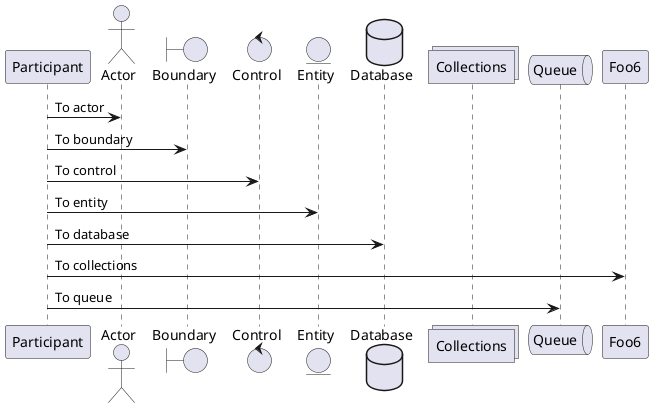

---
{"dg-publish":true,"permalink":"/2-021/20220917-000-np-exec-exec-sp-executesql/"}
---


# <font color=#DC143C>(20220917)-(语句学习)-(000)-(NP)-(EXEC与EXEC SP_EXECUTESQL的用法及比较)</font>
URL:: [EXEC与EXEC SP_EXECUTESQL的用法及比较](https://blog.csdn.net/johnf_nash/article/details/78868263)

```
dataview
table without id 入榜亮点, 入榜输出
where contains(TITLES, "")
```

| 萃取重点                                                                                                                                                                                                                                                                                                                                                                                                                                                                                                                                                                                                                                                                                                                                                                                                                                                                                                                                                                                                                                                                                                                                                                                                                                                                                                                                                                                                                                                                                                                                                                                                                                                                                                                                                                                                                                                                                                                                                                                                                                                                                                                                                          |
| ------------------------------------------------------------------------------------------------------------------------------------------------------------------------------------------------------------------------------------------------------------------------------------------------------------------------------------------------------------------------------------------------------------------------------------------------------------------------------------------------------------------------------------------------------------------------------------------------------------------------------------------------------------------------------------------------------------------------------------------------------------------------------------------------------------------------------------------------------------------------------------------------------------------------------------------------------------------------------------------------------------------------------------------------------------------------------------------------------------------------------------------------------------------------------------------------------------------------------------------------------------------------------------------------------------------------------------------------------------------------------------------------------------------------------------------------------------------------------------------------------------------------------------------------------------------------------------------------------------------------------------------------------------------------------------------------------------------------------------------------------------------------------------------------------------------------------------------------------------------------------------------------------------------------------------------------------------------------------------------------------------------------------------------------------------------------------------------------------------------------------------------------------------- |
| <ul><li><strong><font color=#E6E022>SP_EXECUTESQL不能接收含有变量拼接的SQL字符串</font></strong></li><li>不推荐使用方式——定义拼接(<strong><font color=#E6E022>变量写在SET</font></strong>)</li><li><strong><font color=#9966CC>无法防止SQL注入</font></strong></li><li><strong><font color=#9966CC>无法重用执行计划</font></strong></li><li><strong><font color=#9966CC>拼接麻烦且容易出错，字符串类型的需要单引号括起来</font></strong></li><li>EXEC：推荐先使用变量存放拼接的sql，再使用exec执行sql</li><li>EXEC只能使用拼接字符串的方式，<strong><font color=#E6E022>不支持使用输入参数</font></strong>，而且执行计划不能重用。因此，一般情况下，推荐使用execsp_executesql的方式，而不是exec。</li><li>无法直接将值传出，只能通过<strong><font color=#FF0000>SELECT变量</font></strong>/<strong><font color=#FF0000>INSERT INTO EXEC</font></strong>等方式看到值</li><li><strong><font color=#9966CC>串联变量的内容也存在性能方面的弊端。SQL SERVER为每一个的查询字符串创建新的执行计划，即使查询模式相同也是这样。</font></strong><sub><mark style="background: #FF5582A6;">★★★★★</mark> </sub></li><li><strong><font color=#9966CC>EXEC除了不支持动态批处理中的输入参数外，他也不支持输出参数。</font></strong></li><li>如果你要把输出返回给调用批处理中的变量，事情就没有那么简单了。<strong><font color=#FF0000>你必须使用INSERT EXEC语法把输出插入到一个目标表中，然后从这表中获取值后赋给该变量。</font></strong></li><li>SP_EXECUTESQL命令比EXEC命令更灵活，因为它提供一个接口，<strong><font color=#E6E022>该接口及支持输入参数也支持输出参数</font></strong>。</li><li>这功能使你可以创建带参数的查询字符串，这样就可以比EXEC更好的重用执行计划，<strong><font color=#E6E022>SP_EXECUTESQL的构成与存储过程非常相似，不同之处在于你是动态构建代码</font></strong>。它的构成包括：<strong><font color=#FF4500>代码块</font></strong>，<strong><font color=#FF4500>参数声明部分</font></strong>，<strong><font color=#FF4500>参数赋值部分</font></strong>。</li><li>`@STMT = <STATEMENT>--类似存储过程主体`：@STMT参数是输入的动态批处理，它可以引入输入参数或输出参数，和存储过程的主体语句一样，只不过它是动态的，而存储过程是静态的，不过你也可以在存储过程中使用SP_EXECUTESQL;</li><li>`@PARAMS = <PARAMS>--类似存储过程参数部分`：@PARAMS参数与定义输入/输出参数的存储过程头类似，实际上和存储过程头的语法完全一样；</li><li>SQ_EXECUTESQL的另一个与其接口有关的强大功能是，你可以<strong><font color=#FF0000>使用输出参数为调用批处理中的变量返回值</font></strong>。利用该功能可以<strong><font color=#E6E022>避免用临时表返回数据</font></strong>，从而得到更高效的代码和更少的重新编译。<strong><font color=#E6E022>定义和使用输出参数的语法与存储过程类似。也就是说你需要在声明参数时指定OUTPUT子句。</font></strong></li><li>SP_EXECUTESQL命令在SQL SERVER中引入的比EXEC命令晚一些，它主要<strong><font color=#E6E022>为重用执行计划提供更好的支持</font></strong>。</li></ul> |


```toc
```

>[!background] 背景介绍
>exec与exec sp_executesql都可以用于执行动态sql。下面先介绍它们的用法，然后再对它们进行比较。
>下面用到的数据库表来自SQL SERVER的示例数据库AdventureWorks2008

## 01.exec与exec sp_executesql用法
### 0101.动态SQL(使用字符串拼接的方式)
+ `萃取重点`:: <strong><font color=#E6E022>SP_EXECUTESQL不能接收含有变量拼接的SQL字符串</font></strong>
+ `萃取重点`:: 不推荐使用方式——定义拼接(<strong><font color=#E6E022>变量写在SET</font></strong>)
    + `萃取重点`:: <strong><font color=#9966CC>无法防止SQL注入</font></strong>
    + `萃取重点`:: <strong><font color=#9966CC>无法重用执行计划</font></strong>
    + `萃取重点`:: <strong><font color=#9966CC>拼接麻烦且容易出错，字符串类型的需要单引号括起来</font></strong>
```SQL
declare @FName2 varchar(20) = 'Ken',
        @PeronType varchar(10) = 'GC',
        @sql nvarchar(1000);
--  不推荐这样使用
exec('select * from Person.Person where FirstName =''' + @FName2 + ''' and PersonType= ''' + @PeronType + '''')
-- sp_executesql 不能接收含有变量拼接的sql字符串。下面的sql执行会报错
-- exec sp_executesql 'select * from Person.Person where FirstName =''' + @FName2 + ''' and PersonType= ''' + @PeronType + ''''
-- 不推荐这样使用：无法防止SQL注入,无法重用执行计划，拼接麻烦且容易出错（字符串类型的需要单引号括起来）
set @sql =  'select * from Person.Person where FirstName =''' + @FName2 + ''' and PersonType= ''' + @PeronType + ''''
exec sp_executesql @sql
```



### 0102.带有输入参数时的使用
>[!summary] 结论
>+ `萃取重点`:: EXEC：推荐先使用变量存放拼接的sql，再使用exec执行sql
>+ `萃取重点`:: EXEC只能使用拼接字符串的方式，<strong><font color=#E6E022>不支持使用输入参数</font></strong>，而且执行计划不能重用。因此，一般情况下，推荐使用execsp_executesql的方式，而不是exec。

```SQL
declare @FName2 varchar(20) = 'Ken',
	@PeronType varchar(10) = 'GC',
	@sql nvarchar(1000);
 
-- 推荐先使用变量存放拼接的sql，再使用exec执行sql
set @sql =  'select * from Person.Person where FirstName =''' + @FName2 + ''' and PersonType= ''' + @PeronType + ''''
exec(@sql)
 
-- 推荐这样使用(可以防止SQL注入，可以重用执行计划）
-- 此处输入参数要加上N,不然会报错：过程需要类型为 'ntext/nchar/nvarchar' 的参数 '@params
set @sql = 'select * from Person.Person where FirstName =@FName and PersonType=@PersonType'
exec sp_executesql @sql, N'@FName varchar(20), @PersonType varchar(10)', @FName2, @PeronType
```

### 0103.带有输入参数时的使用
>[!summary] 结论
>+ 使用exec：
>    + exec sql内无法访问sql之外定义的变量，直接使用下面的会报错：必须声明变量"@cnt"。`exec('select @cnt=count(1) from Person.Person; select @cnt')`
>    + 外部也无法访问到exec sql里定义的变量。
>    + `萃取重点`:: 无法直接将值传出，只能通过<strong><font color=#FF0000>SELECT变量</font></strong>/<strong><font color=#FF0000>INSERT INTO EXEC</font></strong>等方式看到值
>+ 使用sp_executesql：此处必须加上<strong><font color=#FF0000>ouput</font></strong>，不然无法取到值。

```SQL
DECLARE @sql NVARCHAR(1000), @cnt INT = -1;
-- 使用 exec
-- exec sql内无法访问sql之外定义的变量，直接使用下面的会报错： 必须声明变量 "@cnt"。外部也无法访问到 exec sql里定义的变量
--无法直接将值传出，只能通过select 变量/insert into exec等方式看到值
--exec('select @cnt=count(1) from Person.Person; select @cnt')
exec('declare @cnt int; select @cnt=count(1) from Person.Person')
print @cnt  -- -1, 无法访问 exec 里取到的  @cnt 的值
 
 
 
 
set @sql = 'select @cnt=count(1) from Person.Person'
exec sp_executesql @sql, N'@cnt int output', @cnt output --此处必须加上ouput，不然无法取到值
print @cnt
```

### 0104.带有输入输出参数时的使用
```SQL
declare @sql nvarchar(1000),
	@cnt int = -1,
	@FName varchar(20) = 'Ken';
 
 
exec('declare @cnt int; select @cnt=count(1) from Person.Person where FirstName = ''' + @FName + ''';  select @cnt')
print @cnt  -- -1
 
set @sql = 'select @cnt=count(1) from Person.Person where FirstName = @FName'
exec sp_executesql @sql, N'@cnt int output, @FName varchar(20)', @cnt output, @FName --此处必须加上ouput，不然无法取到值
print @cnt
```

### 0105.insert into exec/exec sp_executesql的使用
```SQL
declare @tmp table (
	BusinessEntityID int,
	FirstName varchar(50),
	LastName varchar(50)
)
 
insert into @tmp
exec sp_executesql N'select top 10 BusinessEntityID, FirstName, LastName from Person.Person'
 
insert into @tmp
exec(N'select top 10 BusinessEntityID, FirstName, LastName from Person.Person')
 
select * from @tmp
```

## 02.exec与exec sp_executesql比较
### 0201.exec与exec sp_executesql都可以用于执行动态sql

### 0202.sp_executesql不能直接使用常量+变量拼接的语句
sp_executesql后面需要直接使用表示拼接后的sql的变量或者sql常量字符串，后面不能直接使用常量+变量拼接的语句。如下面的语句会报错：
```SQL
declare @FName2 varchar(20) = 'Ken',
	@PeronType varchar(10) = 'GC',
	@sql nvarchar(1000);
 
exec sp_executesql 'select * from Person.Person where FirstName =''' + @FName2 + ''' and PersonType= ''' + @PeronType + ''''
```

这种情况下需要先将SQL拼凑后的结果放入一个变量中，然后使用EXEC SP_EXECUTESQL执行；或者使用入参的方式来实现。推荐使用下面的方式：
```SQL
declare @FName2 varchar(20) = 'Ken',
	@PeronType varchar(10) = 'GC',
	@sql nvarchar(1000);
set @sql = 'select * from Person.Person where FirstName = @FName2 and PersonType = @PeronType'
exec sp_executesql @sql, N'@FName varchar(20), @PersonType varchar(10)', @FName2, @PeronType
```

### 0203.SP_EXECUTESQL参数列表的要求
SP_EXECUTESQL要求动态SQL和动态SQL参数列表必须是NVARCHAR，<strong><font color=#E6E022>动态SQL的参数列表与外部提供值的参数列表顺序必需一致，且不能使用变量</font></strong>。

### 0204.SP_EXECUTESQL的入参和出参优势
EXEC查询不能使用SQL外面定义的变量，查询的结果也不容易进行使用。而EXEC SP_EXECUTESQL可以使用<strong><font color=#FF4500>入参</font></strong>和<strong><font color=#FF4500>出参</font></strong>的方式很方便的获取或者返回内容。

### 0205.SP_EXECUTESQL重用执行计划
SP_EXECUTESQL可以建立带参数的查询字符串还可以重用执行计划。通过下面的示例来了解一下。
+ 首先是EXEC：使用exec执行三次后，查询到的执行计划缓存如下
    + 
    + 通过上面的截图可以看到，<strong><font color=#E6E022>执行三次生成了三次执行计划</font></strong>。
+ 下面来看一下exec sp_executesql，同样执行三次之后，查询到的执行计划缓存如下
    + 
    + 通过上面的截图可以看到，<strong><font color=#E6E022>只生成了一次执行计划</font></strong>。

>[!attention] EXEC
```SQL
DBCC FREEPROCCACHE  -- 清空执行计划缓存
 
DECLARE @Sql NVARCHAR(MAX),@ID INT; 
SET @ID = 15; -- 15使用之后，换成10， 12等再次执行
SET @sql = 'SELECT * FROM Person.Person WHERE BusinessEntityID = '+CAST(@ID AS VARCHAR(10))+' ORDER BY BusinessEntityID DESC'
EXEC(@sql); 
 
SELECT cacheobjtype,objtype,usecounts,sql FROM sys.syscacheobjects WHERE sql NOT LIKE '%cach%' AND sql NOT LIKE '%sys.%'
```

>[!attention] SP_EXECUTESQL
```SQL

DBCC FREEPROCCACHE
 
DECLARE @Sql NVARCHAR(MAX),@ID INT; 
SET @ID = 17; 
SET @sql = 'SELECT * FROM Person.Person WHERE BusinessEntityID = @ID ORDER BY BusinessEntityID DESC'
exec sp_executesql @sql, N'@ID int', @ID
 
SELECT cacheobjtype,objtype,usecounts,sql FROM sys.syscacheobjects WHERE sql NOT LIKE '%cach%' AND sql NOT LIKE '%sys.%'
```

### 0206.sp_executesql可以建立带参数的查询字符串可以防止sql注入
```SQL
--下面的SQL注入
DECLARE @Sql NVARCHAR(MAX), @FName VARCHAR(20);
SET @FName = '''ken'' or 1=1';
SET @Sql = 'SELECT * FROM Person.Person WHERE FirstName = ' + @FName + ' ORDER BY BusinessEntityID DESC'
EXEC sp_executesql @Sql

--下面的可以防止SQL注入
DECLARE @Sql NVARCHAR(MAX), @FName VARCHAR(20);
SET @FName = '''ken'' or 1=1';
SET @Sql = 'SELECT * FROM Person.Person WHERE FirstName = @FName ORDER BY BusinessEntityID DESC'
EXEC sp_executesql @Sql, N'@FName varchar(20)', @FName
```

## 03.EXEC和SP_EXECUTESQL使用介绍
>[!background] 背景介绍
>EXEC命令有两种用法，一种是<strong><font color=#E6E022>执行一个存储过程</font></strong>，另一种是<strong><font color=#E6E022>执行一个动态的批处理</font></strong>。以下所讲的都是第二种用法。

```SQL
DECLARE @TableName VARCHAR(50), @Sql NVARCHAR(MAX), @OrderID INT;
SET @TableName = 'Orders';
SET @OrderID = 10251;
SET @Sql = 'SELECT * FROM ' + QUOTENAME(@TableName) + 'WHERE OrderID = ' + CAST(@OrderID AS VARCHAR(10)) + ' ORDER BY ORDERID DESC'
--PRINT @Sql
--EXEC(@Sql)
```

>[!attention] 注意事项
>注：这里的EXEC括号中只允许包含一个字符串变量，但是可以串联多个变量，如果我们这样写EXEC，SQL编译器就会报错，编译不通过。
```SQL
PRINT(('SELECT TOP('+ CAST(@TopCount ASVARCHAR(10)) +')* FROM '+QUOTENAME(@TableName)+' ORDER BY ORDERID DESC'))
EXEC('SELECT TOP('+ CAST(@TopCount ASVARCHAR(10)) +')* FROM '+QUOTENAME(@TableName)+' ORDER BY ORDERID DESC');
```

>[!attention] 正确用法
>如果我们这样编译器就会通过。<br/>
>所以<strong><font color=#E6E022>最佳的做法是把代码构造到一个变量中，然后再把该变量作为EXEC命令的输入参数，这样就不会受限制了。</font></strong>
```SQL
EXEC(@sql+@sql2+@sql3);
```

### 0301.EXEC不提供接口
+ 这里的接口是指它不能执行一个包含一个带变量符的批处理。
+ 使用EXEC时，如果您想访问变量，必须把变量内容串联到动态构建的代码字符串中。
+ `萃取重点`:: <strong><font color=#9966CC>串联变量的内容也存在性能方面的弊端。SQL SERVER为每一个的查询字符串创建新的执行计划，即使查询模式相同也是这样。</font></strong><sub><mark style="background: #FF5582A6;">★★★★★</mark> </sub>
+ `萃取重点`:: <strong><font color=#9966CC>EXEC除了不支持动态批处理中的输入参数外，他也不支持输出参数。</font></strong>
    + 默认情况下，EXEC把查询的输出返回给调用者。
    + `萃取重点`:: 如果你要把输出返回给调用批处理中的变量，事情就没有那么简单了。<strong><font color=#FF0000>你必须使用INSERT EXEC语法把输出插入到一个目标表中，然后从这表中获取值后赋给该变量。</font></strong>

```SQL
SET @Sql = 'SELECT * FROM ' + QUOTENAME(@TableName) + 'WHERE OrderID = ' + CAST(@OrderID AS VARCHAR(10)) + 'ORDER BY ORDERID DESC'
```

```SQL
DECLARE @sql NVARCHAR(MAX), @RecordCount INT
SET @sql = 'SELECT COUNT (ORDERID) FROM Orders';

CREATE TABLE #T (TID INT);

INSERT INTO #T EXEC(@sql);
SET @RecordCount = (SELECT TID FROM #T)
SELECT @RecordCount
DROP TABLE #T
```

### 0302.SP_EXECUTESQL的使用
>[!attention] 注意事项
>`萃取重点`:: SP_EXECUTESQL命令在SQL SERVER中引入的比EXEC命令晚一些，它主要<strong><font color=#E6E022>为重用执行计划提供更好的支持</font></strong>。

```SQL
DECLARE @TableName VARCHAR(50), @sql NVARCHAR(MAX), @OrderID INT, @sql2 NVARCHAR(MAX);
SET @TableName = 'Orders ';
SET @OrderID = 10251;
SET @sql = 'SELECT * FROM ' + QUOTENAME(@TableName) + ' WHERE OrderID = ' + CAST(@OrderID AS VARCHAR(50)) + ' ORDER BY ORDERIDDESC'
PRINT @sql
EXEC sp_executesql @sql
```

>[!summary] SP_EXECUTESQL优势
+ SP_EXECUTESQL提供接口
+ `萃取重点`:: SP_EXECUTESQL命令比EXEC命令更灵活，因为它提供一个接口，<strong><font color=#E6E022>该接口及支持输入参数也支持输出参数</font></strong>。
+ `萃取重点`:: 这功能使你可以创建带参数的查询字符串，这样就可以比EXEC更好的重用执行计划，<strong><font color=#E6E022>SP_EXECUTESQL的构成与存储过程非常相似，不同之处在于你是动态构建代码</font></strong>。它的构成包括：<strong><font color=#FF4500>代码块</font></strong>，<strong><font color=#FF4500>参数声明部分</font></strong>，<strong><font color=#FF4500>参数赋值部分</font></strong>。
    + `EXEC SP_EXECUTESQL`
    + `萃取重点`:: `@STMT = <STATEMENT>--类似存储过程主体`：@STMT参数是输入的动态批处理，它可以引入输入参数或输出参数，和存储过程的主体语句一样，只不过它是动态的，而存储过程是静态的，不过你也可以在存储过程中使用SP_EXECUTESQL;
    + `萃取重点`:: `@PARAMS = <PARAMS>--类似存储过程参数部分`：@PARAMS参数与定义输入/输出参数的存储过程头类似，实际上和存储过程头的语法完全一样；
    + `<PARAMS ASSIGNMENT>--类似存储过程调用`：`@<PARAMS ASSIGNMENT>与调用存储过程的EXEC部分类似。`
+ `萃取重点`:: SQ_EXECUTESQL的另一个与其接口有关的强大功能是，你可以<strong><font color=#FF0000>使用输出参数为调用批处理中的变量返回值</font></strong>。利用该功能可以<strong><font color=#E6E022>避免用临时表返回数据</font></strong>，从而得到更高效的代码和更少的重新编译。<strong><font color=#E6E022>定义和使用输出参数的语法与存储过程类似。也就是说你需要在声明参数时指定OUTPUT子句。</font></strong>

```SQL
DECLARE @TableName VARCHAR(50), @sql NVARCHAR(MAX), @OrderID INT;
SET @TableName = 'Orders ';
SET @OrderID = 10251;
SET @sql = 'SELECT * FROM ' + QUOTENAME(@TableName) + ' WHERE OrderID = @OID ORDER BY ORDERID DESC'
EXEC sp_executesql @stmt = @sql, @params = N'@OID AS INT ', @OID = @OrderID
```

>[!example] 用法案例
>例如下面的静态代码简单的演示了如何从动态批处理中利用输出参数@p把值返回到外部批处理中的变量@i。
```SQL
DECLARE @sql AS NVARCHAR(12), @i AS INT;
SET @sql = N' SET @p = 10';
EXEC sp_executesql @stmt = @sql, @params = N'@p AS INT OUTPUT', @p = @i OUTPUT
SELECT @i
```