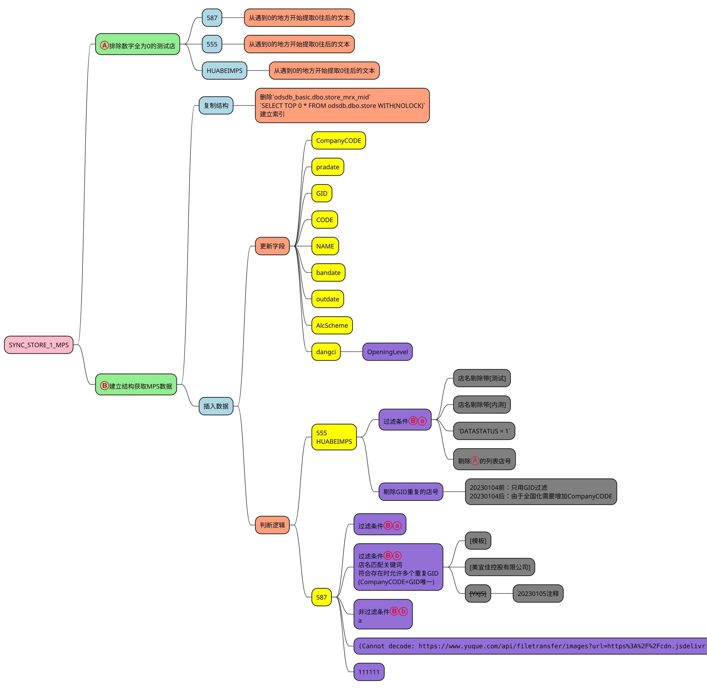

---
{"dg-publish":true,"permalink":"/plantuml-show/","tags":"gardenEntry"}
---

```plantuml
@startmindmap
scale 8000*4000
<style>
mindmapDiagram{
               .rose {
                      BackgroundColor #FFBBCC
                     }
               .green {
                       BackgroundColor lightgreen
                      }
               .blue {
                      BackgroundColor lightblue
                     }
               node {
                     BackgroundColor #FFBBCC
                    }
               :depth(1) {
                          BackgroundColor lightgreen
                         }
               :depth(2) {
                          BackgroundColor lightblue
                         }
               :depth(3) {
                          BackgroundColor LightSalmon
                         }
               :depth(4) {
                          BackgroundColor Yellow
                         }
               :depth(5) {
                          BackgroundColor MediumPurple
                         }
               :depth(6) {
                          BackgroundColor grey
                         }
               :depth(7) {
                          BackgroundColor grey
                         }
               }
</style>
+ SYNC_STORE_1_MPS
++ <b><font color=#DC143C size=20>Ⓐ</font></b>排除数字全为0的测试店
+++ 587
++++ 从遇到0的地方开始提取0往后的文本
+++ 555
++++ 从遇到0的地方开始提取0往后的文本
+++ HUABEIMPS
++++ 从遇到0的地方开始提取0往后的文本
++ <b><font color=#DC143C size=20>Ⓑ</font></b>建立结构获取MPS数据
+++ 复制结构
++++ 删除`odsdb_basic.dbo.store_mrx_mid`\n`SELECT TOP 0 * FROM odsdb.dbo.store WITH(NOLOCK)`\n建立索引
+++ 插入数据
++++ 更新字段
+++++ CompanyCODE
+++++ pradate
+++++ GID
+++++ CODE
+++++ NAME
+++++ bandate
+++++ outdate
+++++ AlcScheme
+++++ dangci
++++++ OpeningLevel
++++ 判断逻辑
+++++ 555\nHUABEIMPS
++++++ 过滤条件<b><font color=#DC143C size=20>Ⓑⓐ</font></b>
+++++++ 店名剔除带[测试]
+++++++ 店名剔除带[内测]
+++++++ `DATASTATUS = 1`
+++++++ 剔除<font color=#DC143C size=20>Ⓐ</font>的列表店号
++++++ 剔除GID重复的店号
+++++++ 20230104前：只用GID过滤\n20230104后：由于全国化需要增加CompanyCODE
+++++ 587
++++++ 过滤条件<b><font color=#DC143C size=20>Ⓑⓐ</font></b>
++++++ 过滤条件<b><font color=#DC143C size=20>Ⓑⓑ</font></b>\n店名匹配关键词\n符合存在时允许多个重复GID\n(CompanyCODE+GID唯一)
+++++++ [模板]
+++++++ [美宜佳控股有限公司]
+++++++ <s>[YXJS]</s>
++++++++ 20230105注释
++++++ 非过滤条件<b><font color=#DC143C size=20>Ⓑⓑ</font></b>\na
++++++ <img:https://www.yuque.com/api/filetransfer/images?url=https%3A%2F%2Fcdn.jsdelivr.net%2Fgh%2F23784148%2Fupload-images%40main%2Ftypora%2F20220928_1664329457.png&sign=1372c2b7e1721a43831f1da26528344769e24448659cec3344a004e759fb40b6 {scale=0.2}>
++++++ 111111
@endmindmap
```